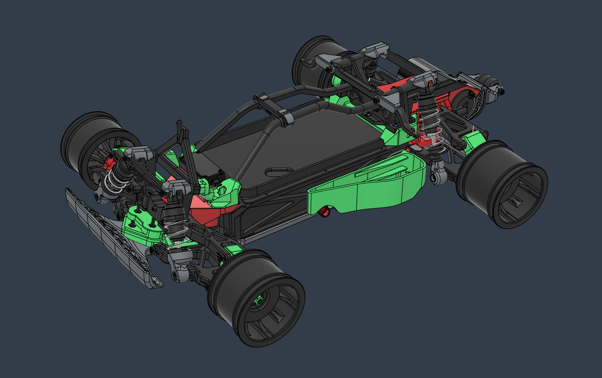
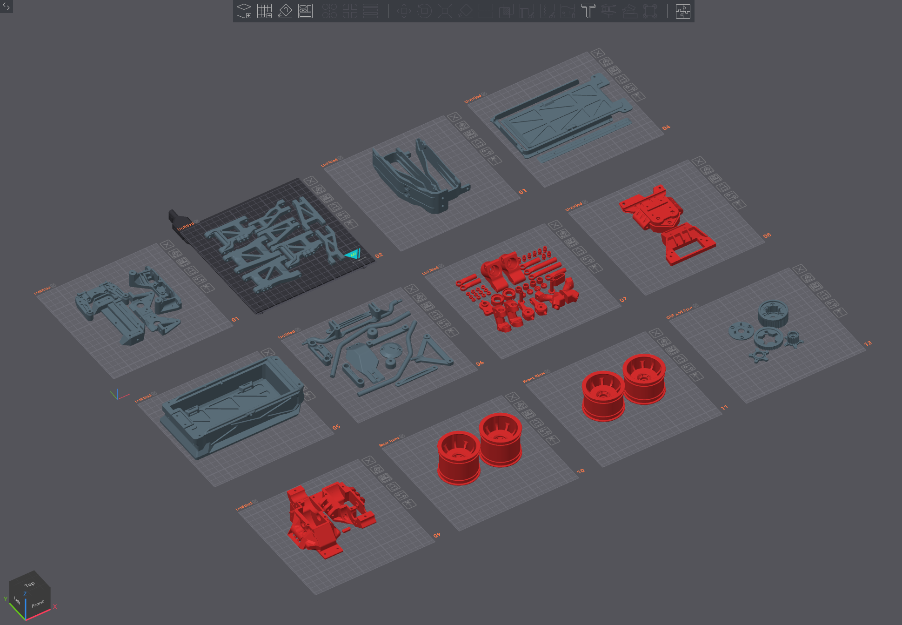
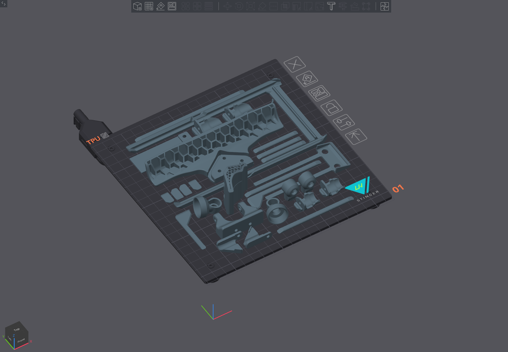
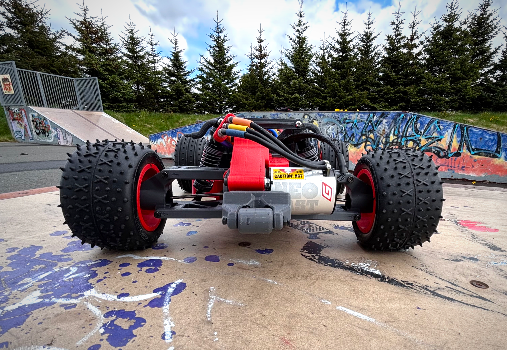

# LHS TAM BLITZER 1/10 R Chassis

## Video

https://youtu.be/My_7cAeliWg

## Description

This is a FDM redesign exercise based on the 1/10 scale Tamiya Blitzer R/C chassis released in 1992 with the Tamiya Stadium Blitzer car, and later with the Tamiya Blitzer Beetle (my original kit).  

The project started with the intention of stiffening some of the original parts and having a source of spares which I could print, but ended up with a complete redesign that took a month an a half.  
I have tried to match the mounting points, so most of the parts are interchangeable with the original chassis, noting that my references were my trusty calipers and my Tamiya kit.  

The car is printed on the LH Stinger 3D Printer in PCTG, TPU 95A and PLA+, with a total weight of 2250g (4600mAh NiMh battery included), close to the original chassis.  

### Specs

Motor: G-Force Neo Fast 13.5T Sensored Brushless Motor (2700KV) on a 13T pinion (10:1 final ratio)  
ESC: QUICRUN 10BL120 SENSORED G2  
Battery: Voltz 4600mAh 7.2V NiMh  

# CAD
http://tiny.cc/lhs-rc1

# Print

PCTG, PLA+, TPU 95A

- todo

# BOM

https://tamico.de

- Tamiya #50602 Differential Bevel Gear
- Tamiya #54048 CR-01 Rein. Wheel Axle*2
- Tamiya #19805551 Drive shaft for 58067 *2
- Tamiya #53218 Hard Joint Cup(for Gear Diff)
- Tamiya #13485038 5x28mm GEAR SHAFT
- Arrma ARA311075 Steel Pinion CNC Machined 12T 0.8 Mod 3.175 mm Bore
- Tires
  - Tamiya #50449 Stadium Blitzer F. Tires
  - Tamiya #50450 Stadium Blitzer R. Tires
- Bearings MR115 x 12
- Shocks 
  - Front: 70-75mm  (eye to eye)
  - Rear: 95-100mm  
  - Oil ~600 CST 
- Screws, washers, nuts (tbd)
- M3 Tap, Super lube, CA Glue, Loctite Extreme Glue - No Drip Gel (For TPU)
- Electronics

- ...

# Assembly

- Reference [CAD](http://tiny.cc/lhs-rc1)
- todo

