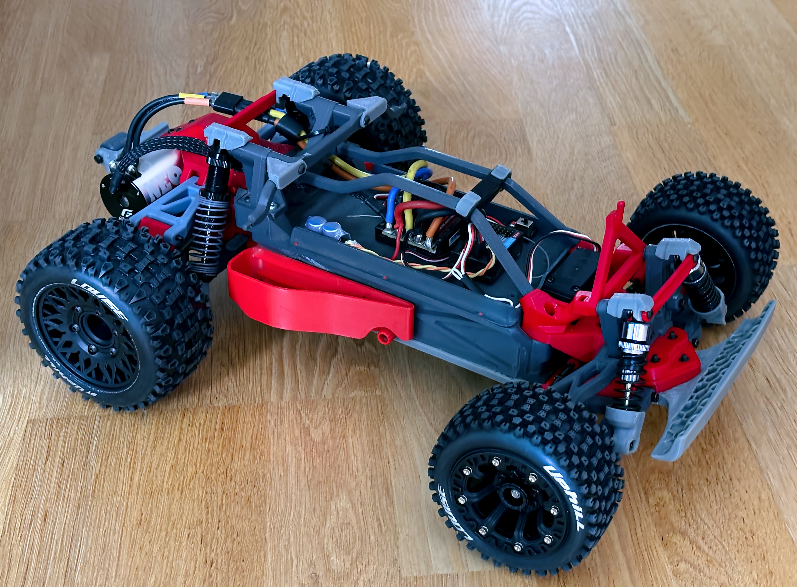
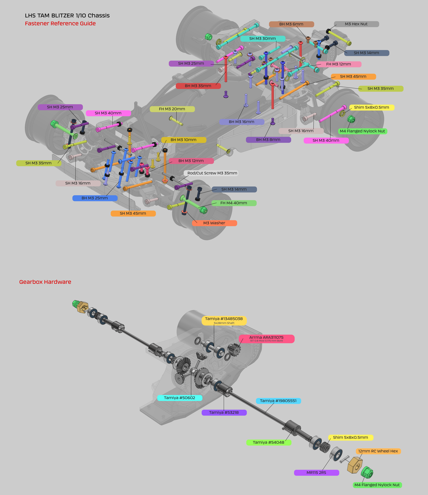

# LHS TAM BLITZER 1/10 R Chassis

## Video

https://youtu.be/My_7cAeliWg

## Description

This is a FDM redesign exercise based on the 1/10 scale Tamiya Blitzer R/C chassis released in 1992 with the Tamiya Stadium Blitzer car, and later with the Tamiya Blitzer Beetle (my original kit).  

The project started with the intention of stiffening some of the original parts and having a source of spares which I could print, but ended up with a complete redesign that took a month an a half.  
I have tried to match the mounting points, so most of the parts are interchangeable with the original chassis, noting that my references were my trusty calipers and my Tamiya kit.  

The provided body posts are compatible with the Tamiya Blitzer Beetle Hard Shell Body  

### Specs

Motor: G-Force Neo Fast 13.5T Sensored Brushless Motor (2700KV) on a 13T pinion (10:1 final ratio)  
ESC: QUICRUN 10BL120 SENSORED G2  
Battery: Voltz 4600mAh 7.2V NiMh  
Weight: 2250g (4600mAh NiMh battery included)

# CAD
[Online CAD Viewer](http://tiny.cc/lhs-rc1)

# Print

- The provided 3mf project files are set up for Orca Slicer and have extensive per-part settings for best print/performance

PCTG, PLA+

TPU 95A

# BOM

[BOM](https://docs.google.com/spreadsheets/d/1pdifgY0qCpqBBOGrd_-9JSDsqHa0moP6McLiiB6KZIc/edit?usp=sharing)

# Assembly

- Reference [Online CAD Viewer](http://tiny.cc/lhs-rc1)
- Hardware Reference Guide :

Notes:

- Break away sacrificial bridges and clean up support areas
- The rear suspension post is composed by two parts that need to be glued together. 
  - Use filament dowels for alignment.
  - Do the same for the attachments on the main body/battery box. 
- Use an M3 tap for parts that screw directly into the plastic. These are designed with 2.6mm diameter holes.
- Don't over torque the screws
- Add a coating of CA glue to parts that rub together, such as the suspension arms mounts or hubs. 
- Expect parts to be stiffer in the beginning and loosen up after a break-in period 
- Inject Super Lube into the holes that receive screws as axles (arms, hubs, etc). 
- Add a generous amount of Super Lube to the spur gears and differential.  
- Glue the TPU parts with Loctite Extreme Glue, Shoe Glue, E6000 etc.
- Don't overtighten the M4 lock nuts on the front wheels. Just enough so they spin freely.
- Lock the wheelie bar nut and screw with CA glue
- Lock the middle nut on the steering faux turnbuckle screws with CA glue
- For best performance the tires will need to be set with foams and glued to the rim 
- Enjoy!

 

# Media

